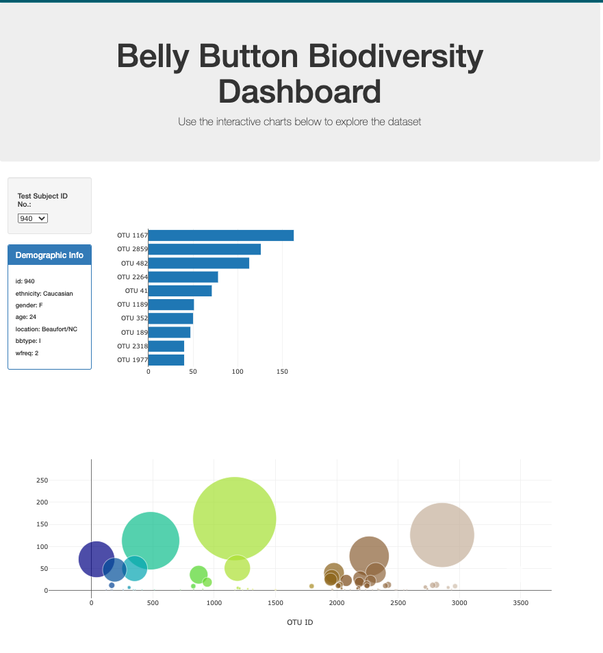

# 
---
## Summary

This assignment involves building an interactive dashboard using the D3 library to explore the **Belly Button Biodiversity dataset**. 
---
## Required Dependancies

N/A - All required libraries are referenced in the index.html file to ensure the dash loads correctly. These include;
-the D3 library  ()
-the Plotly library ( )

## Working Notes

This particulaer assignment was incredibly challenging. Being asked to *'create'* from scratch using a reletively new language was indeed a challenge - however, I was able to utilise what we'd learnt to complete this assignment.

The app.js file utilises a few functions to extract, transform and load the data into the dash correctly. I found that I was able to minimise my use of functions by nesting a large portion of the code under one function to save having to load in the data several times throughout the file.

The dash will load with the first value in the dropdown selected by default - from here the dropdown menu will allow you to. navigate through the different id's to update the data on the dashboard. 

By selecting a value in the dropdown, the following will happen;

-The panel will update with the values the updated metadata
-The bar chart will update with the top 10 OTUs found for that id
-The bubble chart will update with each sample for that id. 

---
## Bonus

I did not attempt the bonus this week.
---
## Criteria

The marking criteria reads as follows;
### Bar Chart (30 points)
- [x] Chart initialises without error (10 points)
- [x] Chart updates when a new sample is selected (5 points)
- [x] Chart uses Top 10 sample values as values (5 points)
- [x] Chart uses otu_ids as the labels (5 points)
- [x] Chart uses otu_labels as the tooltip (5 points)

### Bubble Chart (40 points)
- [x] Chart initialises without error (10 points)
- [x] Chart updates when a new sample is selected (5 points)
- [x] Chart uses otu_ids for the x values (5 points)
- [x] Chart uses otu_ids for marker colors (5 points)
- [x] Chart uses sample_values for the y values (5 points)
- [x] Chart uses sample_values for the marker size (5 points)
- [x] Chart uses `otu_labels for text values (5 points)

### Metadata and Deployment (30 points)
- [x] Metadata initialises without error (10 points)
- [x] Metadata updates when a new sample is selected (10 points)
- [x] App Successfully Deployed to Github Pages (10 points)
---
## Other Comments

There was multiple versions of the app.js file initially, however this was condensed (locally) to remove redundancies. This task really allowed me to confirm my understanding of functions more than anything. I think as a general remark, understanding functions is key to optimising code. While I still feel inexperienced with javascript, I was able to utilise my fundimenatals to complete this task. 

***Javascript hoo-rah...***

